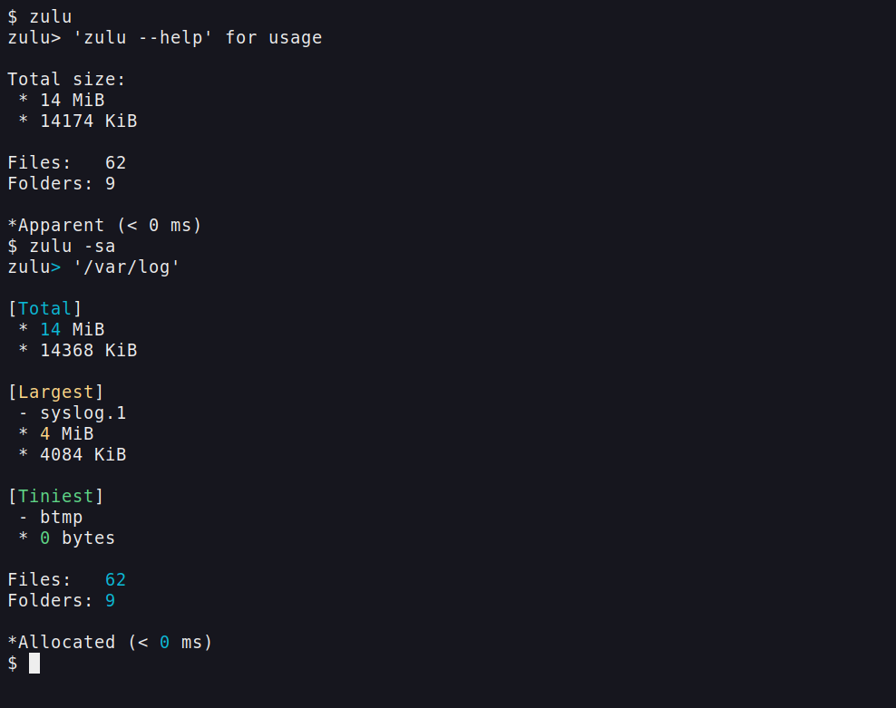

# Zulu CLI

> Performant directory summaries in a readable format

* **Requirements:** C compiler and a POSIX system, no other dependencies.

* **Changelog:** [right here](./CHANGELOG.md)

* **Versions:** in [releases](https://github.com/Ivory-Hubert/zulu/releases)

* **Integration:** [examples](./docs/EXAMPLES.md) using piped output 

## Appearance

That's the basic output and summary version in action:

## Features

* Works in the current directory or a provided one.
* Lists only useful units together, depending on sizes: Gib & MiB | MiB & KiB | Bytes.
* Can list the files counted, always lists the biggest & smallest file.
* Simple output mode that skips some logic, to display only total size & count, and only in the largest unit needed.
* Byte output mode that skips math entirely, only lists as it reads. Will also output in a parser-friendly format if piped.

Some output [examples](./docs/pics)

> [!NOTE]
> Zulu does not report any metadata other than file size. Does not go into subdirectories. Ignores non-files entirely.

## About

I made this with efficiency in mind, and what's less efficient than having to use bash aliases or bloated tools to
check how large some folders files are, and what's the biggest file?
So Zulu was born, it takes less flags than du and ls take combined to show a similar summary,
and it runs laps on TUI's if you don't need every detail.

So, if you need a TUI that shows you every files full metadata and many folders at once, Zulu is not it.
But if you need to check source code size, log folders, /any/system/directory etc... Zulu is your ~1 ms friend (usually).

Do note that you should either trust my provided binary (*reverse engineer for assurance*) or compile it yourself.
I naturally have the `compile.sh` script in root for gcc users. 
Then drop it in `~/.local/bin` or make a bash alias to the binary for easy access.

## License

Copyright © 2026 Ivori Huobolainen

This program is free software: you can redistribute it and/or modify
it under the terms of the GNU General Public License as published by
the Free Software Foundation, either version 3 of the License, or
(at your option) any later version.

This program is distributed in the hope that it will be useful,
but WITHOUT ANY WARRANTY; without even the implied warranty of
MERCHANTABILITY or FITNESS FOR A PARTICULAR PURPOSE. See the
[GNU General Public License version 3](https://www.gnu.org/licenses/gpl-3.0.html) for more details.

